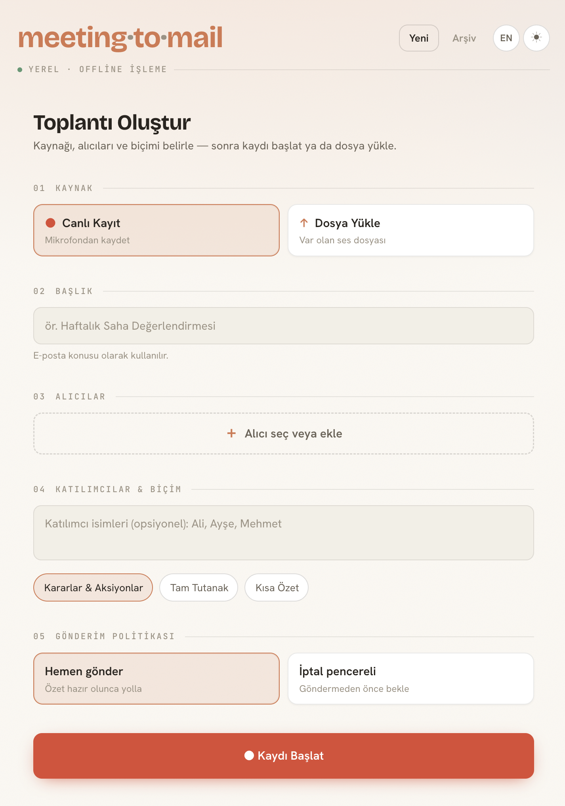
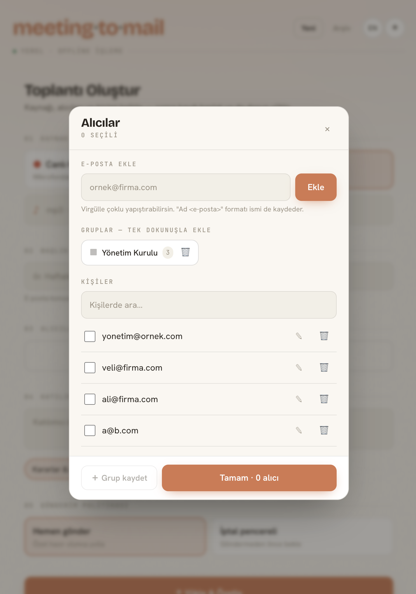
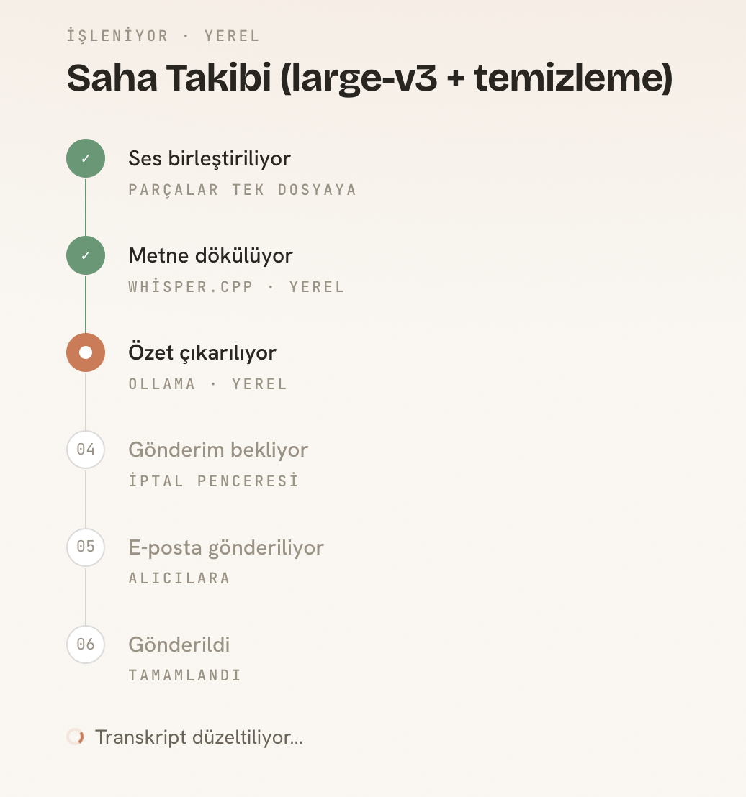

<div align="center">

**English** · [Türkçe](README.tr.md)

# meeting·to·mail

### Record a meeting → transcribe it **on-device** → turn it into structured minutes → mail them to the right inboxes.

**The audio never leaves the machine. Nothing is uploaded to a cloud API. No internet required.**

[](https://github.com/ahaygun/meeting-to-mail/actions/workflows/ci.yml)


</div>

<div align="center">
  
  <br />
  <sub><em>Set up → start → stop → minutes land in the right inboxes. A <strong>LOCAL · OFFLINE PROCESSING</strong> badge and a TR/EN language toggle sit at the top.</em></sub>
</div>

---

## Why it's different — the audio never leaves the device

Almost every "meeting → summary" tool on the market uploads the audio to a **cloud API** (OpenAI, Deepgram, AssemblyAI…) and sends the text to a cloud LLM. That means your meeting's raw audio and transcript pass through third-party servers.

**meeting·to·mail** runs **both heavy steps on the device**:

| | Typical cloud tools | **meeting·to·mail** |
|---|---|---|
| Audio → text (ASR) | OpenAI / Deepgram / AssemblyAI (cloud) | **whisper.cpp — on-device** |
| Text → summary (LLM) | GPT / Gemini / Claude (cloud) | **Ollama — on-device** |
| Where does raw audio go? | uploaded to 3rd-party servers | **nowhere — it never leaves the disk** |
| Internet | required | **not required** (except the mail send itself) |
| Privacy / GDPR | data-processor agreement needed | **data never leaves the organization** |

> **The only thing that goes out is the final minutes you already meant to email.** The raw audio and transcript stay on the device.
> Cloud providers (OpenAI Whisper, Gemini) are supported only as an **optional fallback** — unless you add a key to `.env`, nothing goes out.

---

## Highlights

- 🔒 **Local-first / offline** — ASR (whisper.cpp) and summarization (Ollama) run entirely on-device; verified end-to-end offline.
- 🎙️ **In-browser recording** — `MediaRecorder` + timeslice **chunked** upload; on a crash only the last chunk is lost. Wake Lock keeps the screen on, with a live timer.
- 📁 **File upload** — instead of a live recording, upload an existing audio file (mp3/m4a/wav/webm…); it's split into ~5 MB chunks client-side and reassembled losslessly.
- 🧾 **Structured minutes** — not plain text: **key points · decisions · action items (owner + date)**. Requested from the LLM as JSON via `responseSchema`, then rendered into the mail body.
- 📨 **Send policy** — `send now` or a `cancel window` (recall within a set period).
- 🕘 **History** — list past sessions, reopen summary/delivery details.
- 👥 **Saved recipients** — entered emails are stored in a contact book; picked/removed from a chip UI in the next meeting.
- ⚡ **Live progress** — every pipeline step is streamed to the UI over SSE.
- 🌐 **Bilingual (TR/EN)** — the whole UI is Turkish/English; instant switch next to the theme toggle, preference stored in the browser. A dependency-free, ~130-key lightweight i18n layer.
- 📱 **Mobile-first & themed** — responsive design, light/dark mode.

<div align="center">
  
  <br />
  <sub><em>Saved recipients & groups: entered emails land in the contact book, picked from a chip UI in the next meeting; added with one tap via a group.</em></sub>
</div>

---

## How it works — the pipeline

```
  Browser                          Go backend (chi)                 On-device processing
  ───────                          ────────────────                 ────────────────────
  🎙️ MediaRecorder ──chunks────►  concatenate + store  ─────────►  🧠 whisper.cpp   (ASR, on-device)
     (~15–30 s chunks)             (local disk)                          │
                                                                         ▼
                                                                    📝 transcript    (on-device)
                                                                         │
                                                                         ▼
                                   send policy  ◄────────────────  🤖 Ollama        (summary, on-device)
                                        │
                                        ▼
                                   📨 email (SMTP/Resend)  ── the only outbound step ─►  recipients
        ▲                               │
        └──────────  ⚡ SSE live progress  ──────────────────────────────┘

   ═══ device boundary: audio and transcript never cross this line ═══════════════════
```

When you hit stop, the pipeline runs **hands-off**: concatenate → ASR → summarize → email per the send policy.

<div align="center">
  
  <br />
  <sub><em>Live progress (SSE). Steps show <strong>whisper.cpp · local</strong> and <strong>ollama · local</strong> — audio and transcript are processed without leaving the device.</em></sub>
</div>

---

## Backend engineering

The stop button just enqueues work; the rest is driven by a small, resilient job system:

- **PostgreSQL-backed job queue** — jobs are claimed **atomically with `FOR UPDATE SKIP LOCKED`**, so multiple workers can run without ever grabbing the same job (no external broker needed).
- **Staged pipeline** — `transcribe → summarize → send` run as **separate jobs, each enqueuing the next**. A step can fail and be inspected independently; the session carries an explicit state machine.
- **Auto-applied migrations** on startup (`backend/db/migrations`).
- **Live progress over SSE** — the worker publishes each transition to an in-process hub that fans out to connected clients.
- **Pluggable providers** — ASR / LLM / mail sit behind interfaces; `main.go` picks *real vs. local vs. stub* per env, logging which one is active at boot.

---

## Local-first architecture

Each layer has a provider interface under `internal/providers`; **if the matching key is in `.env` the real service is used, otherwise a local one or a stub** (decided in `main.go`). The priority runs from local to cloud:

| Layer | 1st choice (local) | 2nd choice (cloud, optional) | Otherwise |
|---|---|---|---|
| **ASR** (audio→text) | **whisper.cpp** — `WHISPER_MODEL` | OpenAI Whisper — `OPENAI_API_KEY` | stub |
| **LLM** (summary) | **Ollama** — `OLLAMA_MODEL` | Google Gemini — `GOOGLE_API_KEY` | stub |
| **Mail** | **SMTP** (self-hosted / Mailpit) — `SMTP_HOST` | Resend — `RESEND_API_KEY` | stub (logs only) |

- **whisper.cpp** — offline, no API, Turkish. Audio never leaves the device; being local, there's no 25 MB file limit. Setup: `scripts/setup_whisper.sh` (whisper-cli + ffmpeg + model).
- **Ollama** — offline summarization. Setup: `brew install ollama && ollama serve && ollama pull qwen2.5:7b`.
- **SMTP** — mail is egress by nature, but with SMTP the data goes through **the organization's own mail server instead of a 3rd-party SaaS**. For dev/offline demo: `docker compose up -d mailpit` (SMTP :1025, inbox at http://localhost:8025) — with no keys at all, the whole pipeline including mail runs offline.
- At startup the log states whether each layer is running **real / local / stub**.

---

## Tech stack

- **Backend** — Go + [chi](https://github.com/go-chi/chi) router · PostgreSQL (pgx) · PostgreSQL-backed job queue (`FOR UPDATE SKIP LOCKED`) · staged pipeline + worker · SSE live progress · audio chunks to local disk.
- **Frontend** — Vue 3 + Vite + Pinia + Tailwind (mobile-first). A central `useRecorder` composable: MediaRecorder + timeslice + chunked upload + Wake Lock + timer. Dependency-free i18n (TR/EN) — `src/i18n.js`.
- **Infra** — PostgreSQL 16 via `docker-compose.yml` (host port **5434**).

---

## Running it

Three terminals:

```bash
# 1) Postgres
docker compose up -d db

# 2) Backend (migrations are applied automatically)
cd backend && go run ./cmd/server          # :8080

# 3) Frontend
cd frontend && npm install && npm run dev  # :5173 (5174 if taken)
```

Open the URL the dev server prints. A microphone permission is required; `getUserMedia` only works on **`localhost` or HTTPS**.

Put provider keys in `backend/.env` (`backend/.env.example` is the template). Without any keys you can still see the full flow end-to-end (whisper.cpp + Ollama locally, mail stub).

### Testing from a phone

Vite serves on the LAN with `host: true`, but phone browsers grant mic access **only over HTTPS** — a LAN IP (http) isn't enough. Use an HTTPS tunnel (Cloudflare Tunnel / ngrok) for phone testing. On desktop, `localhost` just works.

> **Note (privacy/GDPR):** Recording a person's voice requires consent. In a deployment, a "recording starting" notice / consent flow is recommended. The local-first architecture lightens this burden: raw audio and transcript never leave the organization.

---

## API (overview)

| Method | Path | Description |
|---|---|---|
| GET | `/api/sessions` | List past sessions (newest first) |
| POST | `/api/sessions` | Create a session (title, recipients, settings) |
| POST | `/api/sessions/{id}/start` | Start recording |
| POST | `/api/sessions/{id}/chunks?seq=N` | Upload an audio chunk (raw body) |
| POST | `/api/sessions/{id}/finalize` | Finalize → trigger the pipeline |
| POST | `/api/sessions/{id}/cancel` | Cancel a pending delivery (`cancel_window`) |
| GET | `/api/sessions/{id}` | Session status |
| GET | `/api/sessions/{id}/summary` | Summary |
| GET | `/api/sessions/{id}/transcript` | Transcript |
| GET | `/api/sessions/{id}/deliveries` | Delivery log |
| GET | `/api/sessions/{id}/events` | SSE progress stream |
| GET | `/api/contacts` | List saved recipients |
| POST | `/api/contacts` | Add/update a contact |
| DELETE | `/api/contacts/{cid}` | Delete a contact |

Detailed architecture, data model and design decisions: [`PROJE_PLANI.md`](PROJE_PLANI.md).

---

## Project status

> **Portfolio / demo project.** Works end-to-end; **audio→text and summarization are fully local/offline** (whisper.cpp + Ollama), verified. There is no authentication (single-organization / internal-use assumption).

**Next steps:**
- `cancel_window` UI and re-summarization ("shorten", "focus on decisions").
- UI polish for clearly surfacing ASR/LLM/mail errors to the user.

---

## License

[MIT](LICENSE)
